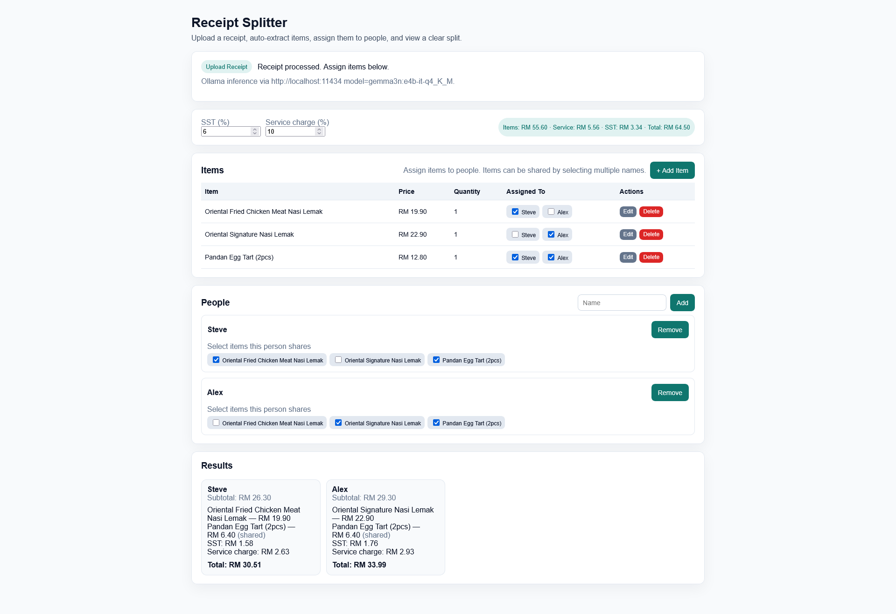

# Receipt Splitter

A web applications for users upload their receipts, and detect & extract items using PaddleOCRv5+Gemma3n Model, great for splitting bills.

> Calculations are based on Malaysian tax culture which typically includes Sales Service Tax (SST) and/or Service Charge.



## About this Project

I frequently help calculate split bills for my peers. For some reason, I still use a calculator app and manually send the breakdown of each user's cost by text. With this app, I can simply screenshot the breakdown easily and send to a groupchat.

This project utilises [PaddleOCR](https://github.com/PaddlePaddle/PaddleOCR) and local-LLM like [Gemma3n](https://deepmind.google/models/gemma/gemma-3n/) for efficient text detection, recognition and field extractions.

### AI Usages

The project was vibe-coded with <b>Cursor</b> with some minor backend code written by me. It took slightly less than a day to complete this project as I just wanted a quick experiment and play around with AI Coding tools. 

> You can locate the starter prompt I used to generate the MVP Skeleton Code via Cursor in `cursor_prompt.md` (Generated using ChatGPT)


## Changelog

* **v0.1.0**
  - Base Application, Local Inference via Ollama
* **v0.2.0**
  - Added Cloud Inference using Google GenAI and PaddleOCR API
  - Minor UI Enhancements for Mobile Browsers
    - Modal Dialog Form for Adding Items
    - Favicons, Link to GitHub Buttons
  - Function to Rate Limit API Calls

### How it Works

1. Simply open the webpage `index.html` in a browser and upload a receipt image (Supports: jpg, jpeg, png). 

2. The image is passed to a backend FastAPI Server which performs the following:

    -  OCR Text Detection 
    -  OCR Text Recognition (Returns a JSON Output)
    -  Text Extraction (Using a Local LLM like `gemma3n:e4b`)
    -  JSON Formatting Output

3.  The structured data is sent back to the webpage. You can then:
    - Add, edit, or delete items.
    - Add or delete people to the split.
    - Assign each item to one or more people (costs are divided evenly).
    - View a summary breakdown of who owes what, with SST and service charges included.

## Pre-Requisites

Before you begin, ensure you have the following installed and set up:

- **Python 3.12+**
- **Ollama**: The backend relies on a locally running Ollama instance to serve the language model.
  - [Download and install Ollama](https://ollama.com/download)
  - Pull the default model required for parsing:
    ```bash
    ollama pull gemma3n:e4b-it-q4_K_M
    ollama run gemma3n:e4b-it-q4_K_M
    ```
    *(You can configure a different model in the `.env` file, but the prompt is tuned for this one.)*

## Local/Cloud Set-Up Guide

### A. Backend (FastAPI Server)

1.  **Install Dependencies**:
    Install all required Python packages, including FastAPI, PaddleOCR, and others.
    ```bash
    pip install -r requirements.txt
    ```

2.  **Configure Environment**
   
    Create a `.env` file in the project root by copying the example file `.env.example`. 
    At a minimum, ensure `OLLAMA_BASE_URL` points to your running Ollama instance.

    For Cloud Inference, ensure you have a **Gemini API Key** from [Google AI Studio](https://aistudio.google.com/api-keys) and a **PaddleOCR Token & URL**  from [Baidu AI Studio](https://ai.baidu.com/ai-doc/AISTUDIO/7mfz6dgx9). 

    > You can find more environment configuration info in the section below.

3.  **Start the Server**:
    Run the FastAPI server using Uvicorn. It will be available at `http://localhost:8000`. The `--reload` flag automatically restarts the server on code changes.
    ```bash
    uvicorn api_fastapi:app --reload --port 8000
    ```
    The first time you run this, PaddleOCR will download its models, which may take some time.

### B. Frontend (React UI)

1.  **Open the File**:
    Simply run `npx serve ./site` and open `http://localhost:3000` in your web browser.
    > No build step or `npm install` is required. It uses React via a CDN and transpiles JSX in the browser.

The application will attempt to connect to the backend at `http://localhost:8000`.

## Environment Configuration (`.env`)

Create a file named `.env` in the root of the project to configure the backend. You can leave the defaults for a standard setup.

```env
# --- Local / Cloud Deployment --- 
# "true" for Local Inference, "false" for Cloud Inference.
LOCAL_HOST_ENABLED="false"


# --- Cloud Configuration ---
# API Configuration for Google GenAI
GEMINI_API_KEY=<GEMINI_API_KEY>
CLOUD_MODEL="gemma-3-4b-it"

# API Configuration for Google GenAI
PP_AI_STUDIO_URL=<PP_AI_STUDIO_URL>
PP_AI_STUDIO_TOKEN=<PP_AI_STUDIO_TOKEN>


# --- Ollama Configuration ---
# The base URL of your running Ollama instance.
OLLAMA_BASE_URL="http://localhost:11434"

# The model to use for receipt parsing. Make sure you have pulled this model.
OLLAMA_MODEL="gemma3:4b-it-q4_K_M"

# Timeout in seconds for the call to the Ollama API.
OLLAMA_TIMEOUT_S="60"


# --- File Paths ---
# Path to the prompt template file.
PROMPT_PATH="prompt.txt"


# --- Logging ---
# Log level (DEBUG, INFO, WARNING, ERROR, CRITICAL). NOTSET disables it.
LOG_LEVEL="INFO"

# File to write logs to.
LOG_FILE="server.log"


# --- PaddleOCR Model Configuration ---
# You generally do not need to change these.
# See PaddleOCR docs for available models.
PADDLE_DET_MODEL="PP-OCRv5_mobile_det"
PADDLE_REC_MODEL="PP-OCRv5_mobile_rec"
```


## Current Limitations & Future Improvements

Some limitations include language (currently only English characters is parsed) as I filtered out any non-ASCII characters to improve extraction quality. Multi-line detection is poor as receipts with items printed in multiple lines detected incorrectly resulting in poor extraction. Improvements could include fine-tuning PP-OCRv5 model (or adjusting built-in parameters), using PP-StructureV3 to parse a `.md` document instead.


## Attribution/Credits

This repository uses the following favicons which was generated using the following graphics from **Twitter Twemoji**:

- Graphics Title: 1f4d1.svg
- Graphics Author: Copyright 2020 Twitter, Inc and other contributors
  (https://github.com/twitter/twemoji)

- Graphics Source: https://github.com/twitter/twemoji/blob/master/assets/svg/1f4d1.svg
- Graphics License: CC-BY 4.0 (https://creativecommons.org/licenses/by/4.0/)